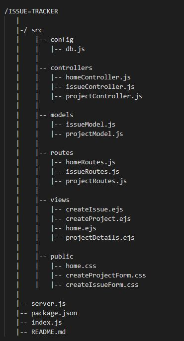
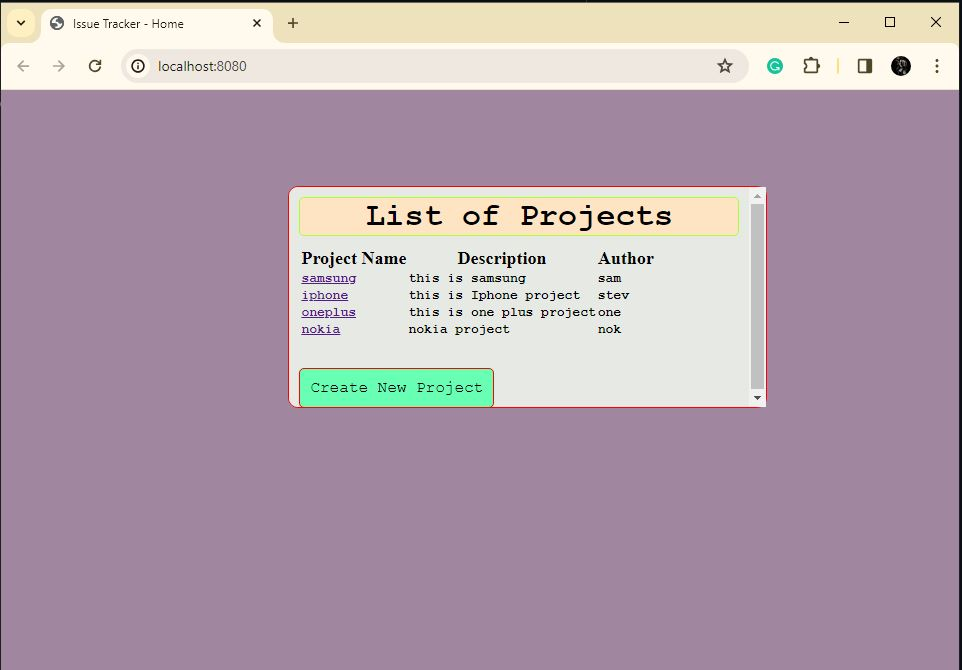
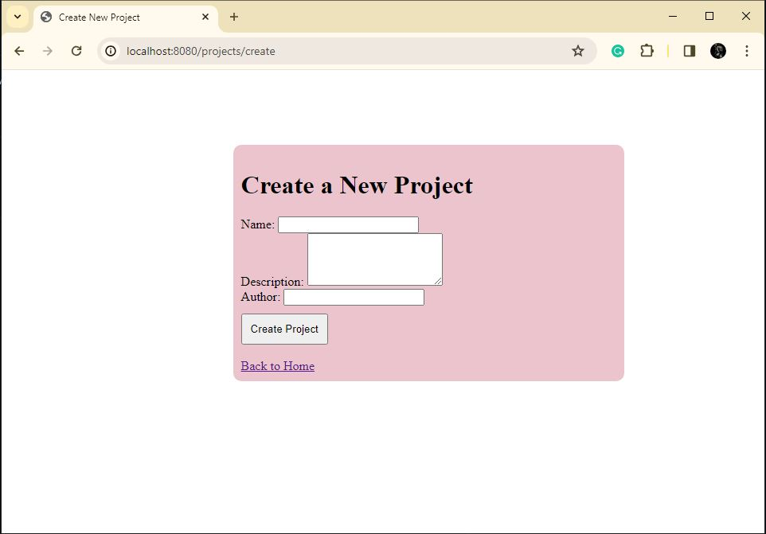
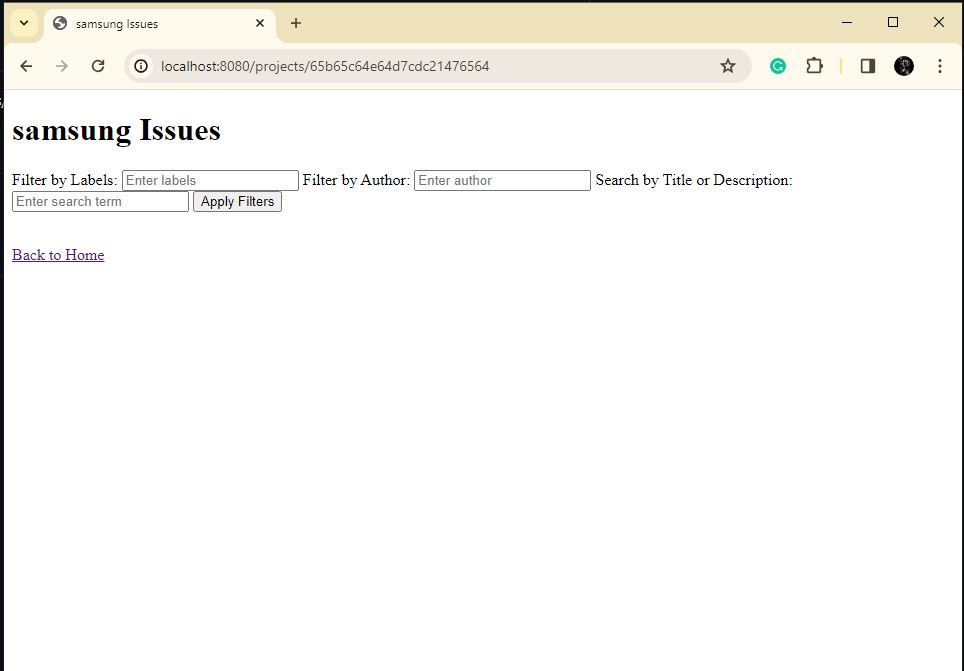

# Issue-Tracker
Nodejs + ejs  application to track issues/bugs for a project

## Project Folder Structure

## Front-End

#### Project Details Page

#### Create Project Page

#### Create Issue Page

## Back-End

#### Data Model
1. Author Model
    - Name
    - Description
    - Author
2. Issue Model
    - Title 
    - Description
    - Labels
    - Author(ref: Author Model)

#### Routes
1. Home Routes
    - URL: http://localhost:${port}/
    - METHOD: GET (allProjectList)

2. Project Routes
    - URL: [
        - http://localhost:${port}/projects/:projectId,
        - http://localhost:${port}.projects/new-project
    ]
    - METHOD: GET POST (ProjectDetails, CreateProject)

3. Issue Routes
    - URL: [
        - http://localhost:${port}/projects/:projectId/issues
        - http://localhost:${port}/projects/:projectId/issues/new-issue
    ]
    - METHOD: GET, POST (getIssues, setIssue)